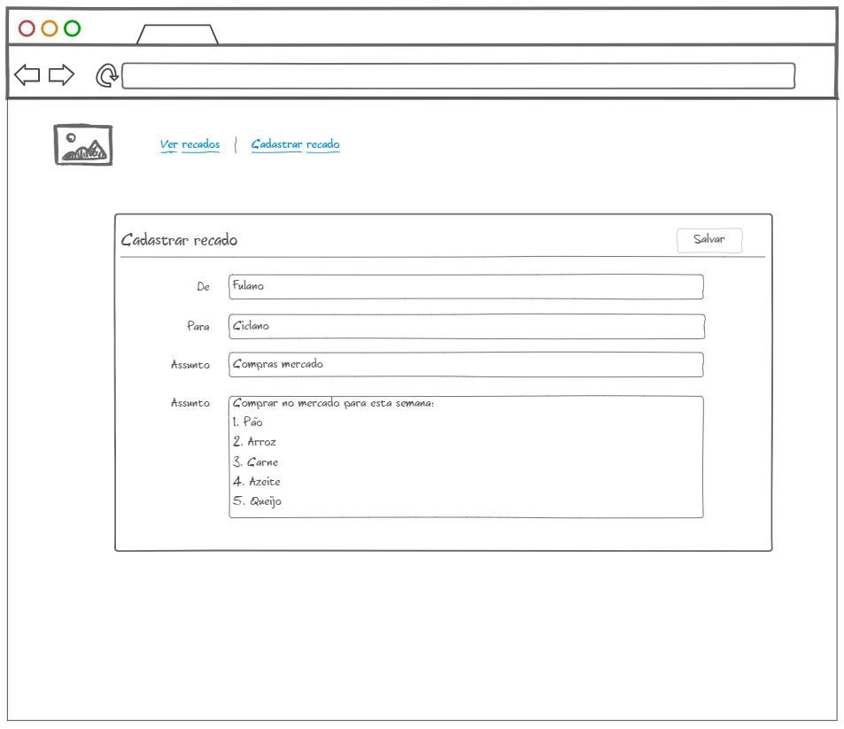
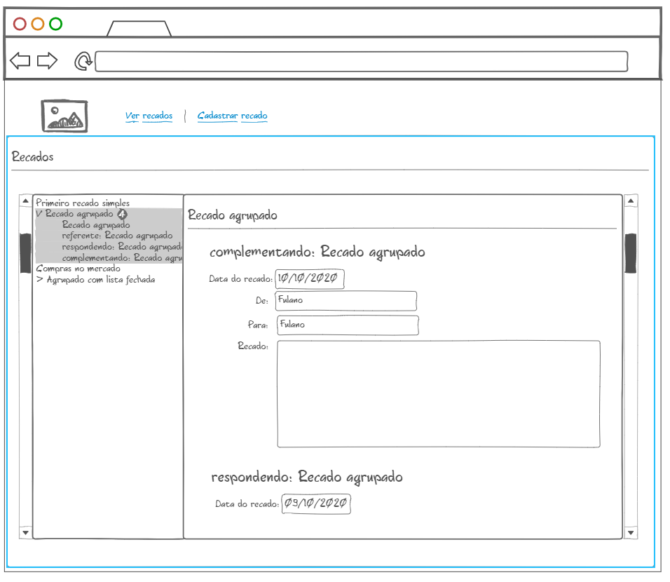

# Introdução

As informações abaixo são necessárias para que você desenvolva e complete o desafio da melhor maneira possível.

## Instruções

* Deve-se utilizar obrigatoriamente a linguagem C# para realização do desafio.
* Utilizar qualquer meio de persistência em disco:
  * Arquivo em disco
  * Banco Relacional
  * Banco Não relacional
* É permitida a consulta à internet e utilização de frameworks adicionais de preferência na implementação.
* Espera-se que o candidato entregue uma solução funcional e bem organizada, com código limpo e de fácil entendimento.
* Pedimos que seja priorizada a funcionalidade do projeto em detrimento de sua interface gráfica / layout.
* Ao concluir nos retornar o link para o código do projeto no e-mail que enviamos o link para o desafio.

### 1 - O que esperamos?  ;-)

* Um sistema funcional.
* Com instruções para preparar o ambiente e executar.

### 2 - Enunciado principal

Criar um sistema de registro de recados que agrupe automaticamente recados relacionados.

### 3. Estrutura do recado

O recado é composto pela seguinte estrutura:

    Recado:
        De
        Para
        Assunto
        Mensagem
        Data do recado
        Agrupado com

### 4. Regras do negócio

Este será um sistema para registro e visualização de recados, onde uma pessoa pode criar um recado que ficará guardado para apresentação.

O sistema permite que o usuário relacione recados, que devem ser apresentados juntos, como um grupo no momento da apresentação.

O recado sendo cadastrado deve ser relacionado a outro automaticamente se houver outro recado nas seguintes condições gravado no sistema:

1. Que tenha remetente (De) ou destinatario (Para) igual ao remetente do recado cadastrado.
2. Que tenha sido registrado a no máximo 6 meses.
3. Que contenha o mesmo assunto, mas ignorando se ele iniciar com:
    * referente:
    * respondendo:
    * complementando:
4. Os recados devem apontar o relacionamento para o primeiro recado do grupo, mesmo que o encontrado na regra seja o mais recente.

**Exemplo de lógica de agrupamento**

| Identificador | Data recado | Assunto                         | De      | Para    | Deve agrupar com |
| ------------- | ----------- | ------------------------------- | ------- | ------- | ---------------- |
| 1             | 01/01/2019  | Primeiro recado                 | Fulano  | Ciclano |                  |
| 2             | 05/01/2019  | respondendo: Primeiro recado    | Ciclano | Fulano  | 1                |
| 3             | 02/02/2019  | Segundo recado                  | Ciclano | Fulano  |                  |
| 4             | 05/03/2019  | complementando: Primeiro recado | Ciclano | Fulano  | 1                |
| 5             | 01/09/2019  | referente: Primeiro recado      | Fulano  | Ciclano | 1                |
| 6             | 30/12/2019  | respondendo: Segundo recado     | Fulano  | Ciclano |                  |
| 7             | 01/01/2020  | Primeiro recado                 | Fulano  | Deltano | 1                |
| 8             | 01/01/2020  | Primeiro recado                 | Deltano | Fulano  | 1                |
| 9             | 01/07/2020  | Primeiro recado                 | Fulano  | Deltano |                  |

### 5. Telas

Esta estrutura é composta por 2 telas, sendo:

1. Cadastro do recado

2. Listagem dos recados cadastrados

### 6 - O que vamos avaliar

* Organização do projeto
* Utilização de boas práticas e padrões arquiteturais
* Clareza do código
* Ausência de bugs
* Detalhes de UI

## Dúvidas

Entre em contato pelo e-mail vagas[arroba]encontact.com.br